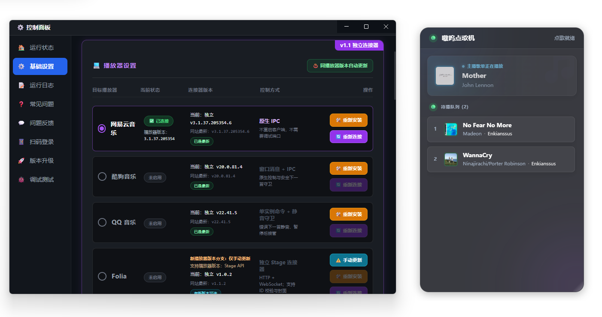

# HaruMusicBot

<p align="center">
  
</p>

易点椿曲基于“嗷呜点歌机”，是一款面向 Bilibili 主播的 Windows 弹幕点歌工具。1.2.2
开始支持网易云音乐、酷狗音乐、QQ 音乐和 Folia，并把各播放器的搜索、
状态读取和控制实现拆成可独立更新的连接器。

项目仓库和底层包标识使用英文名 `HaruMusicBot` / `haru-musicbot`，安装后的
程序、窗口、快捷方式及其它面向用户的名称均为“易点椿曲”。

## 发布通道

- **易点椿曲 1.1.x**：推荐的新架构。支持四种播放器、游客模式、
  独立连接器、HTTP/WebSocket 只读接口和内置问题反馈；功能更多、体验
  更好，但仍可能遇到播放器私有协议变化带来的兼容性或稳定性问题。
- **BiliNCM 1.0.x**：旧稳定通道。功能较少，主要面向原有网易云流程，
  但经过更长时间验证。1.0.x 只接收同系列修复，不会被自动升级到 1.1.x。

两个通道通过 `https://app.enkianss.us` 独立检查和下载更新。

## 主要功能

- B站弹幕点歌、撤回、置顶、插队、切歌与分级冷却。
- 游客模式可直接连接直播间并使用普通点歌和撤回；扫码登录仅用于超级
  用户白名单及自定义权限控制。
- 所有弹幕指令先进入有界队列，再严格逐条处理，避免并发搜索、插队和
  队列修改互相冲突。
- 四个播放器连接器按需自动安装并在后台检查更新；更新包经过
  SHA-256 与 Ed25519 签名校验，健康检查通过后才会激活。
- 1.1.3 起优先使用小体积的框架依赖连接器，并按 x86/x64 架构一次性安装
  点歌机私有的共享 .NET 8 Runtime；失败时自动回退 SelfContained 完整包。
  旧版点歌机继续使用同一清单中的完整包，不要求用户自行安装 .NET。
  1.1.4 起在本站小体积包代理暂不识别新资产名时，会先尝试受信任的
  GitHub Release 直链；直链也失败才回退完整包。
- 播放器切换后自动启动对应连接器并持续探测连接状态。
- 点歌机只把本地待播队列的第一首预插入播放器。该歌曲真正开始播放后，
  才会插入下一首；后续歌曲不会提前批量写入播放器队列。
- 四个连接器均保留错误下一首守卫：如果播放器实际切到的歌曲与本地队首
  不同，会暂停或停止错误歌曲并立即接管目标歌曲。
- 可选择展示主播歌单当前歌曲，并可选择点歌人头像或歌曲封面。
- 可选的本机只读 HTTP 与 WebSocket 接口，供 OBS、插件或其它本地工具
  实时读取当前歌曲和待播队列。
- 1.1.5 起支持可安装、切换的 OBS Mod UI：可以识别 GitHub 仓库，也可以
  选择或拖入本地 ZIP；切换 UI 后 OBS 浏览器源地址保持不变。
- “运行状态”会显示播放器当前歌曲、当前启用的 Mod UI，并可直接跳转到
  Mod 设置。内置 UI 和官方示例均采用透明组件布局。

## 快速开始

1. 启动需要使用的播放器，并确保它可以正常播放歌曲。
2. 启动点歌机，在“基础设置”中选择播放器。
3. 第一次选择某个播放器时，点歌机会自动下载并安装对应连接器；不需要
   为网易云添加调试端口，也不会为此重启播放器。
4. 在“运行状态”填写 B站直播间房间号并连接。扫码登录不是必需步骤。
5. 在 OBS 或直播姬中添加浏览器源。原有整页地址为
   `http://127.0.0.1:5555/`，Mod UI 地址默认为
   `http://127.0.0.1:5556/overlay/`；若修改了外部接口端口，请使用界面中
   “运行状态”显示的实际地址。

连接器是非公开播放器协议的适配层。播放器更新后，如果某项私有能力发生
变化，只需发布对应连接器的新版本，不需要同步发布点歌机本体。

## 弹幕指令

| 指令 | 功能 | 游客模式 |
|---|---|---|
| `点歌 歌名或ID` | 搜索并加入待播队列 | 可用 |
| `撤回` | 删除自己最近点的一首歌 | 可用 |
| `置顶点歌 歌名` | 放到本地待播队首 | 需登录并满足权限 |
| `插队点歌 歌名` | 中断当前歌曲并插播 | 需登录并满足权限 |
| `立即点歌 歌名` | 立即播放目标歌曲 | 需登录并满足权限 |
| `切歌` / `跳过` | 跳过当前歌曲 | 需登录并满足权限 |
| `开始接单` / `停止接单` | 切换接单状态 | 需登录并满足权限 |

醒目留言（SC）内容以 `点歌` 或 `點歌` 开头且包含歌曲关键词时，也会进入点歌流程，
并自动置顶到本地待播队首。SC 点歌默认仍受点歌权限、冷却和“同一用户只能同时
点一首”规则约束，各规则可在基础设置中分别开启 SC 豁免。

不同播放器使用各自的直接点歌格式：

- 网易云和 Folia：`id=1403356922` 是明确歌曲 ID；6 位以上纯数字是疑似
  ID，会与同文本关键词搜索并行，精确 ID 存在时优先，否则使用关键词结果。
- 酷狗：支持纯数字分享码、`#17154574#`、`chain=ig6N5bG4V3`、裸 chain
  及完整 `m.kugou.com/share/song.html?chain=...` 链接；精确解析失败时回退关键词。
- QQ 音乐：支持完整 `c6.y.qq.com/base/fcgi-bin/u?__=...` 分享链接、
  `u?__=0eBs266kH6Oj` 和裸 12 位分享码；普通纯数字保持关键词搜索。

## 本地只读接口

在“基础设置”中可以分别启用 HTTP API 和 WebSocket 推送，并设置监听端口。
接口只绑定 `127.0.0.1`，默认端口为 `5556`。

- `GET /health`
- `GET /api/v1/state`
- `GET /api/v1/current`
- `GET /api/v1/queue`
- `ws://127.0.0.1:5556/ws`
- OBS 浏览器源示例：`http://127.0.0.1:5556/overlay/`

接口只提供播放与队列状态，不接受控制命令。
完整字段、兼容规则和第三方前端接入方式见
[`docs/external-api.md`](docs/external-api.md)；可直接修改的零构建示例源码位于
[`examples/obs-overlay`](examples/obs-overlay)。

## OBS Mod UI

在“运行状态 → Mod UI”中可以：

- 输入 GitHub 仓库或发布清单网址，识别并安装 UI。
- 选择本地 ZIP，或将 Mod UI ZIP 拖到安装区域。
- 查看当前使用的 UI，并在已安装的 UI 之间切换。

OBS 始终使用同一个 `/overlay/` 地址，安装或切换 UI 后不需要修改浏览器源。
第三方 UI 的清单、ZIP 结构和安全限制见
[`docs/overlay-mods.md`](docs/overlay-mods.md)。官方示例仓库为
[`Enkianssus/HaruMusicBot-Overlay-Default`](https://github.com/Enkianssus/HaruMusicBot-Overlay-Default)。

## 本地开发

```powershell
npm ci
npm test
npm run lint
npx tsc --noEmit
npm run build:dev
```

连接器位于 `BiliNCM-Connectors` 子项目：

```powershell
dotnet build .\BiliNCM-Connectors\BiliNCM.Connectors.slnx -c Release
```

## 技术栈

- Electron、Node.js、React、Vite、TypeScript、Tailwind CSS
- .NET 8 Windows x86/x64 独立播放器连接器与私有共享 Runtime
- Bilibili 原生弹幕 WebSocket
- Velopack、GitHub Actions、Cloudflare 下载代理

## 许可

本项目基于 MIT License。使用时仍需遵守 Bilibili 及各音乐平台的服务条款。
